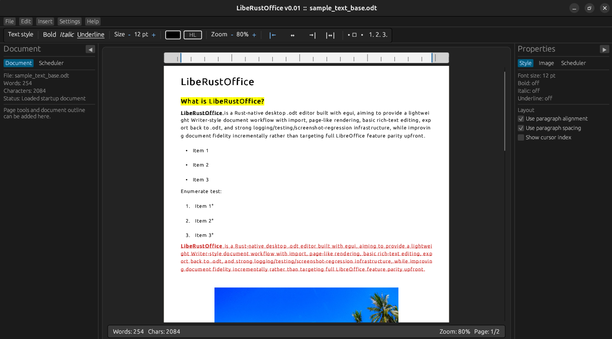

# ⚠️ ForgiatuSuiteDocs Text ⚠️ (WARNING: Vibe Coded Project)

**ForgiatuSuiteDocs** is a ODT (Open Document Text format) text editor, which has been vibe coded in the spare time with Codex. But not gonna lie, I wouldn't define it a "project" at this stage, because it barely exists...

## ⚠️ DISCLAIMER!!! ⚠️

This project has been built from scratch in Rust and it is not related or endorsed in any case and in any way by more famous Open Source Office Suites.

## 🚧 Planned Features 🚧 

- [x] Open and read '.odt' documents
- [x] Create and save new '.odt' files
- [x] Rich text formatting (bold, italic, underline, strikethrough)
- [x] Paragraph alignment (left, center, right, justified)
- [ ] Font customization (size, family, color)
- [x] Bullet and numbered lists
- [ ] Headings and document structure support
- [x] Insert and resize images into documents
- [ ] Table creation and editing
- [ ] Hyperlink support
- [ ] Undo / Redo functionality
- [x] Keyboard shortcuts for productivity
- [ ] Search and replace
- [ ] Export to PDF
- [x] Fast and lightweight (written in Rust 🦀)
- [ ] Real-time collaboration
- [ ] MCP support
- [ ] Track changes / comments
- [ ] Spell checking and grammar suggestions
- [ ] Full LibreOffice Compatibility
- [ ] Cloud sync integration (Maybe one day)

Stay Tuned!
